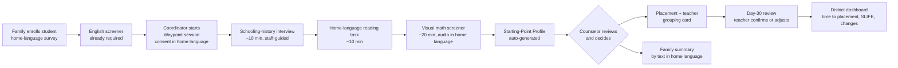

# Waypoint: Pitch Kit

**Team:** HaYoung Kong, Samuel Quansah, Martin Sosa, Benjamin Karp
**Working name:** *Waypoint* (placeholder; check the trademark before public use)
**Contents:** solution statement · 60-second pitch · target customer and value proposition · user stories · user flow · prototype · pitch deck · Business Model Canvas · assumptions to test

---

## 1. Solution statement

**One sentence**
> Waypoint gives schools a consistent way to see where each middle and high school newcomer starts in math, home-language reading, and prior schooling on the day they enroll, and turns that into a placement recommendation staff can defend and a summary families can understand.

**Full statement**
> Middle and high school newcomers, especially students with limited or interrupted formal education (SLIFE), arrive with widely varying academic starting points. Schools screen English at enrollment, but rarely check math or reading in the student's home language, so placement depends on the district more than on the student.
>
> Waypoint is a 45-minute starting-point check that school staff run in person at enrollment. It has three parts:
> 1. a **visual math screener** with audio instructions in the student's home language
> 2. a short **home-language reading task**
> 3. a guided **schooling-history interview**
>
> Waypoint combines those results with the English screener the school already gives and produces:
> - a one-page **Starting-Point Profile** with a suggested placement and the evidence behind it
> - first-month **groupings** for teachers
> - a plain-language **family summary** sent in the family's language
>
> A **30-day review** confirms or adjusts the placement. Waypoint informs the school's decision; staff make the final call. It never collects immigration status.

**Positioning**
> For **district multilingual directors** who must place newcomers quickly and fairly, **Waypoint** is an **in-school starting-point check** that shows what each student knows in math and in their home language on day one. **Unlike** i-Ready or Lexia, it works across many home languages, covers grades 6–12, and runs with an adult present, not as homework.

---

## 2. The 60-second pitch (121 words, ~60 seconds)

> In Massachusetts, older newcomers in Springfield are 38 percentage points more likely to be placed in ninth grade than similar newcomers in Boston. Placement depends on the district, not on what students know. Schools test English at enrollment but rarely math or home-language reading. Waypoint is a 45-minute check run in school: a visual math screener, a home-language reading task, and a schooling-history interview. We sell to district multilingual directors who need placements they can defend in week one. Counselors get a one-page profile; families get a summary in their language. A teacher told us i-Ready and Lexia go unfinished when students work alone at home, so Waypoint runs with an adult. Next, we'll test whether intake staff trust its results.

**How it covers the Part 4 checklist**

| Required element | Sentence in the pitch |
|---|---|
| Compelling statistic | "In Massachusetts, older newcomers in Springfield are 38 percentage points more likely to be placed in ninth grade than similar newcomers in Boston." (Mantil et al., 2026) |
| Problem | "Placement depends on the district, not on what students know. Schools test English at enrollment but rarely math or home-language reading." |
| Solution | "Waypoint is a 45-minute check run in school: a visual math screener, a home-language reading task, and a schooling-history interview." |
| Target customer / buyer | "We sell to district multilingual directors…" |
| Value proposition | "…who need placements they can defend in week one. Counselors get a one-page profile; families get a summary in their language." |
| Key learning from discovery | "A teacher told us i-Ready and Lexia go unfinished when students work alone at home, so Waypoint runs with an adult." |
| What to test next | "Next, we'll test whether intake staff trust its results." |

**Backup version (123 words)**, using the team's own statistics from the same source. Use it if the 38-point figure can't be confirmed before presenting:

> About half of Massachusetts high school newcomers arrive at 16 or older, and only 15 percent of the 2024 cohort left high school proficient in English. These students have no time to lose, yet schools test English at enrollment and rarely check math or home-language reading. Waypoint is a 45-minute check run in school: a visual math screener, a home-language reading task, and a schooling-history interview. We sell to district multilingual directors who need placements they can defend in week one. Counselors get a one-page profile; families get a summary in their language. A teacher told us i-Ready and Lexia go unfinished when students work alone at home, so Waypoint runs with an adult. Next, we'll test whether intake staff trust its results.

**Delivery:**
- Pause after the statistic.
- Slow down on "not on what students know."
- If asked about next steps, give the concrete plan: 8–10 interviews with Massachusetts intake staff, then a 10–20 student pilot at one school.

**Before presenting:** confirm the 38-point figure and its wording in *Land of Opportunity?* (Mantil et al., 2026). It was taken from press coverage of the report.

---

## 3. Target customer and value proposition

| Role | Who | What they get |
|---|---|---|
| **Buyer** | District multilingual / English-learner director | Consistent, defensible placement across schools; SLIFE identification that follows state guidance; data for reporting |
| **Primary user** | Newcomer intake coordinator, counselor | A structured session instead of guesswork; auto-drafted documentation; less paperwork |
| **Secondary user** | Newcomer math and ESL teachers | A day-one grouping card; a 30-day review prompt |
| **Beneficiary** | Newcomer student, grades 6–12 | Placed by what they know, not by the English they have yet to learn |
| **Beneficiary** | Guardian | A summary in their own language, and a way to ask questions |

**Value proposition in one line:** *Know where every newcomer starts, in week one.*

---

## 4. User stories (MVP first)

**Personas** (fictional, for design):
- **Dana:** newcomer intake coordinator, mid-size Massachusetts district
- **Mr. Alves:** newcomer math teacher
- **Wislande:** 16, from Haiti, 8 years of school, reads Haitian Creole
- **Kevin:** 15, from Guatemala, speaks K'iche' and some Spanish, 4 years of school with interruptions
- **Marie:** Wislande's aunt and guardian
- **Dr. Okafor:** district multilingual director (the buyer)

| # | As a… | I want to… | So that… | Acceptance criteria | Priority |
|---|---|---|---|---|---|
| 1 | Intake coordinator | start a Waypoint session from a new enrollment in under 2 minutes | the check happens the same day the student enrolls | Session created from name, grade by age, home language; guardian consent captured in their language | **MVP** |
| 2 | Student | hear instructions in my home language and answer math questions with pictures and numbers | my math knowledge isn't hidden by my English | Audio in ≥5 languages; items need no English reading; adaptive stop at ~20 minutes | **MVP** |
| 3 | Intake coordinator | follow a guided schooling-history interview with interpreter prompts | I record years of school and interruptions the same way for every student | ~10 questions; aligned with MA SLIFE guidance; no immigration questions exist in the form | **MVP** |
| 4 | Student | read a short passage in my home language and answer questions about it | the school knows whether I can read and write in my first language | Passages at 3 levels in each supported language; scored by rubric | **MVP** |
| 5 | Counselor | see a one-page profile with a suggested placement range and the evidence behind it | I can make the decision and defend it | Profile ready within 5 minutes of session end; shows confidence level; staff decision recorded | **MVP** |
| 6 | Guardian | get a short message in my language explaining where my child starts and why | I understand the decision and can ask questions | Text/WhatsApp summary; reply routes to the intake coordinator | **MVP** |
| 7 | Math teacher | get a grouping card for my new students | I know on day one who needs foundational number work | Card lists skill bands and suggested first lessons | Next |
| 8 | Math/ESL teacher | get a prompt at day 30 to confirm or flag the placement | wrong first guesses are caught early | One-tap confirm / adjust with a reason | Next |
| 9 | Multilingual director | see time-to-placement, SLIFE identification, and placement changes across schools | I can improve consistency and report to the state | Dashboard by school and language; export for state reporting | Next |
| 10 | Student aged 16+ | find out whether I can earn world-language credit by testing in my home language | I get credit for what I already know | Flag on the profile when district policy allows credit by proficiency | Later |

---

## 5. User flow

| Step | Who | Time | Output |
|---|---|---|---|
| 1. Enroll + home-language survey | Family, registrar | Existing | Student record |
| 2. English screener | ESL staff | Existing | English proficiency level (reused) |
| 3. Start session + consent | Intake coordinator | 2 min | Session; consent in home language |
| 4. Schooling-history interview | Coordinator (+ interpreter) | 10 min | Years of schooling, interruptions, last school type |
| 5. Home-language reading | Student | 10 min | Home-language literacy level (1–4) |
| 6. Visual math screener | Student (adult present) | 20 min | Math starting band (e.g., grade 5–6) and skill gaps |
| 7. Profile | System | Instant | One page: evidence, suggested placement, SLIFE flag, confidence |
| 8. Decision | Counselor | 5 min | Placement recorded (staff decide) |
| 9. Family summary | System → guardian | Same day | Text in home language; replies go to coordinator |
| 10. Day-30 review | Teacher | 1 min | Confirm or adjust, with reason |

---

## 6. Prototype

A clickable prototype of the flow above, with 9 screens and sample data:

1. Intake queue
2. Start session
3. Schooling interview
4. Reading task
5. Math screener (student view)
6. Starting-Point Profile
7. Family summary (Haitian Creole / English)
8. Day-30 review
9. Director dashboard

- File: [`prototype.html`](prototype.html). Download it and open it in any browser.
- Hosted version: <https://claude.ai/artifact/FFaQexZTkUBtoev4NPGTb7> (private until shared from its Share menu).
- All names and numbers are fictional samples.
- The Haitian Creole text is a draft and must be reviewed by a native speaker before any user sees it.

---

## 7. Pitch deck

A 12-slide deck, with the pitch script in the speaker notes: <https://claude.ai/artifact/71qxqXwRpMkrgPhjmi3FyL> (private until shared from its Share menu; it can be exported to PowerPoint or PDF).

1. Waypoint: know where every newcomer starts
2. The statistic: 38 percentage points
3. The problem
4. What we learned (customer discovery)
5. The solution
6. How it works (user flow)
7. The product (profile)
8. Who pays and why
9. Competition
10. Business model
11. What we test next
12. Team and ask

---

## 8. Business Model Canvas

| Block | Content |
|---|---|
| **Customer segments** | **Buyer:** district multilingual/EL directors in Massachusetts districts with growing newcomer enrollment (grades 6–12). **Users:** intake coordinators, counselors, newcomer math and ESL teachers. **Beneficiaries:** newcomer students (esp. SLIFE) and guardians. **Later:** newcomer centers, state education agency (DESE), other states. |
| **Value propositions** | See each newcomer's math and home-language literacy starting point on day one. Consistent, defensible placement across schools. SLIFE identification aligned with state guidance. Less paperwork (auto-drafted documentation). Families understand the decision in their language. A day-30 review catches misplacement early. |
| **Channels** | Direct outreach to EL directors; the MA DESE Office of Language Acquisition SLIFE community of practice; MATSOL (the state ESL teachers' association) conference; research partners (Brown/Annenberg, Harvard); pilot case studies and referrals; later, integration with EL data platforms (e.g., Ellevation) and student information systems. |
| **Customer relationships** | Co-designed pilots with 1–2 districts; in-person training for intake staff; named support contact; quarterly placement review with the director. |
| **Revenue streams** | **Annual district license** tiered by newcomer enrollment: ~$6k (≤50 newcomers/yr), ~$15k (≤200), ~$30k+ (larger). Paid from Title III and local funds (confirm allowability). **Paid pilot:** $2–5k per semester. **Training/PD:** per session. **Later:** state contract. Families never pay. *(All prices are hypotheses to test.)* |
| **Key resources** | A language-light math item bank validated across languages; home-language reading passages written by native-speaker educators; recorded audio; an interview protocol aligned with MA SLIFE guidance; a secure platform; de-identified placement-and-outcome data. |
| **Key activities** | Item and passage development; validation (does the screener agree with teacher judgment at day 30?); translation and audio recording; pilots and training; privacy compliance; district sales. |
| **Key partners** | MA DESE Office of Language Acquisition; pilot districts and newcomer centers; bilingual educators and community organizations (translation, family outreach); university researchers (validation); EL data and student information system vendors (integration). |
| **Cost structure** | Content creation per language (items, passages, audio); engineering; validation study; training and support staff; security and compliance (FERPA, MA student data privacy agreements); sales. Cost per student served falls as languages and items are reused. |

---

## 9. Riskiest assumptions and next tests

| Assumption | Why it's risky | Test | Pass signal |
|---|---|---|---|
| Intake staff lack a consistent way to check math and home-language literacy | Some MA districts or state tools may already do this | 8–10 interviews with MA intake staff and EL directors: "Walk me through your last newcomer enrollment" | ≥6 describe no consistent math or home-language check |
| Staff will trust the profile enough to use it | New assessments face skepticism | Paper-prototype pilot with 10–20 students at one school | Counselors use the profile in ≥70% of decisions |
| The math screener is accurate across languages | Audio and visuals may not remove all language load | Compare screener band with teacher judgment at day 30 | Agreement in ≥75% of cases |
| Districts will pay | Budgets are tight; the state might offer something free | Ask 3 directors for a pilot letter of intent at $2–5k | ≥1 signed letter |
| Families find the summary useful | Literacy, phone access, and trust vary | Send summaries to pilot families; track replies and follow-up questions | ≥50% open/reply; guardians can restate the placement |

---

## Sources

- Mantil, A., Papay, J. P., Ferguson, I. M., Quintero, D., & Murnane, R. J. (2026). *Land of Opportunity? Immigrant Newcomers in Massachusetts High Schools.* Annenberg Institute at Brown University. ([report page](https://annenberg.brown.edu/edopportunity/land-of-opportunity) · [Education Week coverage](https://www.edweek.org/teaching-learning/immigrant-students-face-big-barriers-to-success-in-high-school/2026/08))
- Massachusetts DESE (2024). [*SLIFE Guidance*](https://www.doe.mass.edu/ele/slife/guidance.pdf).
- Team competitive analysis (i-Ready, Lexia) and Mom Test interview (South Carolina educator), 2026.
